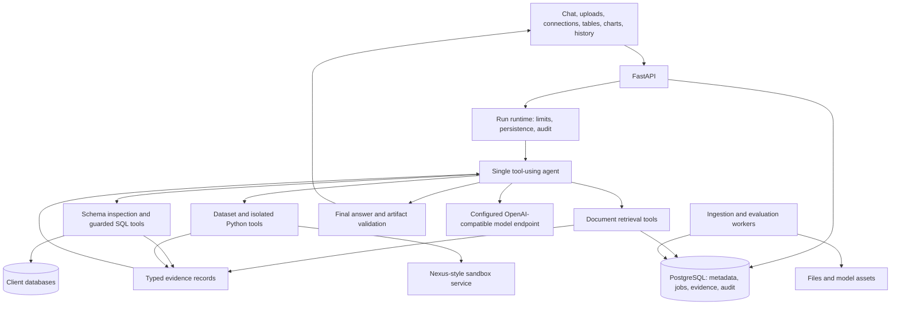

# Agentic RAG and data analyst: working design

Status: discussion draft, not an approved implementation plan. Updated 2 October 2026.
For implementation, follow [the phase plans](../plans/README.md), which incorporate
the subsequent decisions and define the build order and acceptance gates.
Confirmed orchestration baseline: one tool-using agent.
Confirmed integration choices: Nexus-style sandbox service, a supplied
OpenAI-compatible model endpoint, and Docker Compose for local development.

## Product goal and confirmed decisions

Build an on-prem analytical workspace that answers questions using documents,
spreadsheets, and databases together. Hindi and English are initial languages.
The system must work with smaller local models, preserve evidence, protect
original sources from modification, and remain practical to operate and scale.

The pilot prioritizes questions that combine document evidence with SQL or
spreadsheet analysis. The product scope includes full RAG and general data
analysis. Initial sources include PDF, DOCX, CSV, Excel, MySQL, and PostgreSQL.
Internet access is available. API server capacity is flexible. We have not
selected an inference hardware profile, model, corpus size, or concurrency target.
Use a capable local model rather than designing the main loop around extremely
small models. Evaluate reliable tool use, analysis, and Hindi/English behavior
when selecting the model.

Use the existing projects as references for behavior and interfaces. Implement
new components here rather than copying either platform wholesale.

Original databases and uploaded files are read-only. Creating derived datasets,
reports, charts, and analysis artifacts is allowed in a separate output workspace.
Cleaning or transforming a file produces a new dataset rather than overwriting
the uploaded original.

Users upload files and add database connections. Treat supplied connections as
ready for analytical use. Database provisioning, primary/replica topology,
department permissions, role-based access, and source-sharing administration are
outside the current scope. Selected files and connections define the inputs to
a run; this selection is not a department-level authorization system.

Local processing of client data is the proposed default. Internet availability
does not itself settle which external services may receive client data. Strictly
air-gapped installation is an optional deployment profile, not a current requirement.

## What the reference code tells us

This was a targeted source review. No existing application was run, and this is
not a security audit or a complete feature verification.

| Reference              | Patterns to carry forward                                                                                                                                                          | Changes needed                                                                                                                             |
| ---------------------- | ---------------------------------------------------------------------------------------------------------------------------------------------------------------------------------- | ------------------------------------------------------------------------------------------------------------------------------------------ |
| `advanced-rag`         | Explicit query stages, extractor choices, structural chunking, hierarchy, hybrid fusion, neighbor expansion, multi-query, decomposition, citations, progress events, import/export | Replace service-specific storage coupling; measure each optional stage; support native multilingual retrieval; add dependent evidence hops |
| `codeagent`            | Project-bound connection tools, schema introspection, typed tables/charts, workspace and executor interfaces, analysis exports                                                     | Enforce read-only access beyond rollback; bound tool results; move generated code into a separate execution boundary                       |
| `nexus`                | PostgreSQL/pgvector retrieval, typed evidence bundles, durable run claims, worker leases, SQL connector interfaces, SQL AST checks, mixed-source evaluation cases                  | Reduce orchestration scope; remove cloud requirements from offline profiles; implement real reranking and language-aware lexical search    |
| `indic-language-utils` | Language registry, provider protocols, routing, translation structure protection, language detection, transliteration, Whisper STT, reviewed UI catalogs                           | Add suitable local translation/TTS providers if required; apply deployment policy to fallback routing and caches                           |

Specific implementation findings:

- `advanced-rag/backend/app/services/query/pipeline.py` already separates query
  stages. Its language stage translates incoming queries to English.
- `advanced-rag/backend/app/services/query/multihop.py` decomposes a question and
  processes subqueries independently. True dependent hops must also use earlier
  evidence to decide the next query.
- `codeagent/backend/app/services/db_connection_service.py::run_readonly_query`
  executes SQL inside a savepoint and rolls it back. Rollback alone is not an
  adequate boundary against all database side effects or excessive queries.
- `nexus/packages/nexus-core/nexus_core/rag/retrieve.py` explicitly treats
  reranking as a no-op. Its lexical repository uses an English configuration.
- Nexus worker run claims use `FOR UPDATE SKIP LOCKED`. That is a useful starting
  pattern for a small durable queue, with leases and ownership checks.
- Nexus's inspected self-host profile requires Clerk and its scanned-PDF path
  uses Google Document AI. Those are dependencies to replace for offline use.
- The language library has local detection, Aksharamukha transliteration, and
  Faster-Whisper STT. The inspected translation and TTS providers are remote.

## Architecture proposal

Start with a modular Python backend, a separate worker process, PostgreSQL with
pgvector and full-text search, file storage, a sandbox service, and a configurable
OpenAI-compatible inference endpoint. The user will supply the model endpoint.
Use FastAPI, Pydantic, SQLAlchemy/Alembic, uv, Black, and standard logging.
Use React, TypeScript, Vite, pnpm, and shadcn for the workspace UI.

The application's PostgreSQL is separate from client source databases. Users
supply ready-to-query MySQL or PostgreSQL endpoints and credentials. The connector
tests connectivity and inspects the schema. Enforce read-only execution, prefer
read-only credentials, and keep secrets outside prompts, retrieved content, and
generated-code environments. Do not build database topology management.

Separate modules for ingestion, retrieval, structured analysis, agent runtime,
language, policy, audit, evaluation, and storage. Introduce interfaces where we
already expect variation, such as model endpoints, extractors, connectors, and
file storage. Avoid a general capability marketplace or platform framework.

## Model configuration

Use the user-supplied OpenAI-compatible endpoint through our own model adapter.
Configuration will accept `OPENAI_BASE_URL`, `OPENAI_API_KEY`, and `OPENAI_MODEL`.
Keep configuration in an ignored local `.env` file or deployment environment;
provide a secret-free `.env.example`. Do not include API keys in prompts, tool
arguments, sandbox environments, audit records, or client-side configuration.

Normalize tool calls, streaming events, usage information, and provider errors
behind the adapter. Verify the supplied endpoint's actual behavior with a live
tool-use and Hindi/English test rather than assuming full feature parity from
API compatibility alone. The endpoint and model remain configurable.

The chat model endpoint does not imply an embedding endpoint. Configure
embeddings and reranking independently, with local multilingual components as
the proposed initial path. Model-serving deployment is outside the application
Compose stack unless explicitly added later.

## Sandbox integration

Use the standalone sandbox service referenced by Nexus, integrated through a
new application-owned HTTP adapter. Reuse the service's session-oriented
execution boundary; keep the application's agent loop independent of Nexus
and DeepAgents. Pin a verified service revision during implementation rather
than copying the entire Nexus codebase.

The adapter should support session creation, execution with captured results,
file upload/read/list, artifact export, heartbeat, stop, and cleanup. Reference
the existing `SandboxBackend` protocol and `/v1/sessions` HTTP contract. Keep
session lifecycle and execution deadlines separate, and test cancellation,
timeouts, artifact collection, and recovery after service failures.

Create or resume a sandbox session for an analysis workspace. Preserve uploaded
originals in application storage and stage working copies or SQL results into
the sandbox. Derived files and reports live in the output workspace and are
exported into durable artifact storage. Never place database or model API
credentials in the guest. SQL execution stays in the connector service.

Use the microsandbox backend for microVM execution as in Nexus. The user
confirms that the existing sandbox works on Mac out of the box. Follow that
established local setup for development; a remote sandbox is not required.
Keep `SANDBOX_BASE_URL` and `SANDBOX_AUTH_TOKEN` configurable for local and
deployed services. Verify startup and execution during integration. Never
silently substitute the service's local subprocess backend for microVM isolation.

Use an analysis runtime image with the required data libraries. Start with the
existing sandbox image as a reference, then select a pinned image and measure
its size and startup cost. Snapshots and additional heavy runtimes are optional
extensions. Session cleanup must preserve exported results and audit references.

## Docker Compose development

Docker Compose is the local development entry point. Follow the reference
applications' split between infrastructure-only and full-stack commands, using
Makefile targets for setup, up, up-all, down, logs, health, and tests. Provide
containerized API/worker and frontend development with reload support, persistent
volumes, health checks, and environment-based configuration.

The core stack includes PostgreSQL/pgvector, API, worker, frontend, and file
storage. Add the sandbox service through a supported microVM Compose profile,
or configure an external sandbox endpoint. Optional MySQL test fixtures support
connector integration tests; they do not provision the client's source database.
Keep the application model endpoint external and configurable. Container
configuration must distinguish service URLs from host URLs.

Follow the existing Mac-compatible sandbox startup and connection pattern in
the local Compose development setup. The inspected Linux-specific Compose
profile does not establish a general Mac limitation for the sandbox. Use
readiness checks that execute a small sandbox command, rather than treating an
HTTP health response as proof of execution.

## Single-agent baseline

One agent owns the conversation, planning, tool selection, follow-up searches,
SQL/Python repairs, and final synthesis. It can use document, database, and file
tools in whatever order the question and observed results require.

The run runtime validates and executes tool calls, records results, persists
progress, and enforces read-only sources and resource budgets. It does not
require a separate planner, router, supervisor, or fixed reasoning sequence.

The main loop is:

1. Call the model with conversation context, relevant instructions, and tools.
2. If it requests tools, validate their arguments and execute allowed calls.
3. Return compact tool results and evidence/artifact references to the model.
4. Repeat until the agent answers, asks for clarification, or reaches a run limit.
5. Validate the final answer's references and artifact metadata, then persist it.

Distinguish clarification, completion, cancellation, failure, and budget
exhaustion in run status. Retain useful intermediate artifacts for incomplete
runs, and communicate their limitations.

The initial tool groups cover source listing, document search and source
passages, schema inspection, dataset profiling, guarded SQL, isolated Python,
and artifact inspection/export. Keep tool descriptions clear and boundaries
distinct. Select relevant schema details and task instructions on demand.

Advanced RAG lives behind retrieval tools. Extraction, chunking, hybrid search,
reranking, query expansion, and context expansion remain modular pipelines.
Some pipeline stages can call models internally without becoming separate
agents. The main agent can perform dependent hops by searching again using
earlier evidence. Coordinate internal expansion budgets with the run budget.

Use typed tool inputs and results with Pydantic validation. Prefer supported
model tool calling, and normalize provider differences in the model adapter.
Constrained decoding can improve format reliability where supported. Validate
identifiers, actions, SQL, and result types independently of JSON validity.

Store large datasets, schemas, and logs as inspectable artifacts. Give the model
compact summaries, selected excerpts, and references it can inspect further.
Preserve definitions, units, assumptions, evidence IDs, and artifact IDs when
compacting conversation context.

Configure maximum tool calls, elapsed time, token/context use, per-tool result
size, and execution resources. Benchmark limits against full analytical tasks;
do not force every task into a predetermined number of hops or SQL repairs.
Short operational explanations and tool events provide transparency without
storing private model reasoning.

Specialist subagents are a possible future extension if evaluations show that
long analytical exploration or specialized context degrades the baseline.
They are not required for the initial implementation. Keep tool modules and
evidence contracts reusable so a later comparison does not require replacing
the retrieval or analysis subsystems.

## RAG capability coverage

Carry forward nearly all useful document capabilities, introduced in stages:

- Ingest PDF and DOCX initially, with text/Markdown and HTML as inexpensive
  additional formats; add PPTX, approved crawling,
  bulk imports, custom chunks, and portable exports as subsequent formats.
- Preserve original files, extracted blocks, reading order, headings, tables,
  page positions, language information, extraction status, and source versions.
- Route digital pages through text extraction and scanned pages through local
  OCR. Handle mixed PDFs per page. Flag uncertain extraction for review.
- Use structure-aware chunks with token limits, parent references, neighbor
  expansion, stable identifiers, and page or block locations.
- Search dense and lexical indexes independently, combine ranks, then apply an
  optional multilingual reranker over a bounded candidate set.
- Add conversational rewriting, limited query expansion, multi-query search,
  independent subquestions, and evidence-dependent hops behind evaluated profiles.
- Preserve hierarchy and offer cached section/document summaries for overview
  questions. Measure hierarchical clustering and thematic summaries before
  enabling them for every ingestion.
- Track citations through generation, translation, persistence, and exports.
  Provide a source viewer and inspectable stage events.

A table in a PDF has two roles. Its text can support retrieval, while its cells
can support calculations only after extraction quality and typing checks.
Register accepted extracted tables as versioned datasets and retain their
page/cell provenance. Do not silently turn uncertain OCR into authoritative data.

## Structured analysis and connecting the sources

Initial file support: CSV and Excel, with typed import and DuckDB-style SQL
execution as a candidate. Clarify whether legacy XLS is needed alongside XLSX.
Initial database support: both PostgreSQL and MySQL, with dialect-specific
introspection, quoting, type handling, and safety tests. File SQL execution must
restrict filesystem access, extensions, and network-capable functions.

Build a compact semantic catalog containing table grain, key relationships,
column meaning, business metrics, units, fiscal periods, available dimensions,
and Hindi/English aliases. Include an entity mapping for district names, IDs,
departments, schemes, and spelling variants when the domain requires it.

Never let a model silently invent a join key, interpretation of a metric,
missing-value policy, or matching between document entities and database IDs.
Resolve known mappings through the catalog and ask about unresolved ambiguity.

Use SQL and deterministic code for arithmetic. Keep results as typed artifacts;
give the model aggregates and selected excerpts rather than complete datasets.
Provide approved transformations and chart specifications for common tasks,
and bounded generated Python for flexible cleaning, statistics, and analysis.
Python execution belongs in the analyst scope and runs through the Nexus-style
sandbox service. Do not expose production database credentials to it; stage
working copies of selected inputs or bounded query results. Keep stored originals
immutable and write derived datasets and artifacts to a separate output workspace.

Each claim should link to evidence. Document evidence contains version, chunk,
page/block, and excerpt. Data evidence contains source, schema version,
SQL/parameters or transformation, timestamp, result artifact, hash, units, and
known limitations. A timestamp alone cannot recreate a changing live database;
retain a result snapshot or source snapshot identifier when
reproducibility is required.

## PostgreSQL and deployment size

PostgreSQL plus pgvector and full-text search is the preferred starting point.
Keep original files outside PostgreSQL. A mounted filesystem suits one host;
shared or S3-compatible storage becomes necessary when workers span hosts.

PostgreSQL's built-in `ts_rank` and `ts_rank_cd` are not BM25. Use an English
configuration for English and test normalized Hindi tokenization with `simple`
or pre-tokenized text. Check Devanagari combining characters and mixed scripts
against real fixtures. Add trigram or domain alias matching only where measured
misses justify it. Preserve original text and a separately normalized search form.

Approximate pgvector indexes trade recall for speed. Benchmark exact search as
the reference and HNSW under realistic document-selection and metadata filters,
since filtering can reduce returned candidates. Tune iterative scans or indexes
when necessary. A query scoped to selected documents should stay in that scope.

Use PostgreSQL jobs with short claim transactions, leases, heartbeats, bounded
retries, cancellation, idempotent stages, and durable progress events. Process
jobs outside database transactions. Treat execution as at least once. Add a
dedicated broker when queue contention, scheduling needs, or throughput warrant it.

Scale API workers, ingestion/OCR workers, analysis workers, and inference
capacity separately. Limit background work so ingestion does not consume the
resources needed for interactive answers. Define lightweight and server profiles
after measuring the complete set of loaded models.

## Language and voice

Treat language as metadata throughout the pipeline, including mixed-language
segments, OCR configuration, retrieval, citations, UI, answers, and evaluation.
Support Hindi, English, code-switching, and Romanized Hindi test cases.

Retrieve original-language text with multilingual embeddings. Add translated or
transliterated query variants selectively. Preserve identifiers, numbers,
proper names, citations, and domain terminology through translation. Do not
require the whole corpus to pass through English.

Use `indic-language-utils` through adapters. A language capability registry
should record offline availability, supported languages, model assets, and
resource requirements. Unsupported capabilities must be explicit. If external
providers are permitted in some deployments, apply the policy to every fallback.

Begin voice with push-to-talk, editable transcripts, and optional read-aloud.
Confirm unclear numbers, names, dates, or filter terms before executing analysis.
Benchmark local STT and available local TTS for Hindi, English, and mixed speech.
Audio retention should be optional and governed separately from chat retention.

## Execution guardrails and audit

Implement controls at the point of action. System prompts supplement these
controls but cannot change the read-only source rule or the execution boundary.

- Bind retrieval and tools to the files and connections selected for the run.
  Preserve original uploads and prohibit source-database mutations.
- Treat retrieved instructions, database text, and tool results as untrusted
  content. They cannot expand tools, network access, or credentials.
- Combine SQL AST validation and identifier/function policy with restricted
  database roles, read-only transactions, query timeouts, and result limits.
  Reject unsafe functions and commands even inside a SELECT expression.
- Isolate generated code outside the API with restricted mounts, no credentials,
  denied network access, resource limits, and a selected isolation mechanism.
  A Python import allowlist is an additional check, not the security boundary.
- Limit ingestion size, archive expansion, parsing time, and file types. Define
  outbound network rules for connectors and approved crawlers.
- Check outputs for invalid citations and unsupported numeric claims.
  Semantic support remains an evaluation problem, not a guaranteed
  deterministic check.

Learn guardrails by building a policy module with typed decisions and negative
tests, then evaluate whether a framework adds useful detection or review tools.
Do not add a mandatory second LLM pass to every action.

Audit run identity, selected sources, actions, validation decisions,
model and prompt versions, pipeline versions, errors, resource use, and artifact
references. Record which source results produced each derived dataset or report.
Keep credentials out of audit records and avoid duplicating complete datasets in
ordinary logs. Advanced compliance, retention administration, and tamper-evident
audit storage are future client-specific requirements, not first-release blockers.

## Evaluation from the first vertical slice

Create a versioned pilot corpus with human-reviewed questions, expected
calculations, relevant evidence, ambiguous cases, and prohibited source-write cases.
Start with a manageable set covering document-only, data-only, mixed-source,
Hindi, English, mixed language, OCR, and voice transcription where available.

Measure components independently:

| Component        | Measures                                                                                                 |
| ---------------- | -------------------------------------------------------------------------------------------------------- |
| Extraction       | Character/word error rate, Hindi numeral/name errors, table cell correctness and reading order           |
| Retrieval        | Recall@k, precision@k, ranking quality, document-scoped recall, cross-language retrieval                 |
| SQL and analysis | Execution result correctness, join/grain correctness, units, null handling, unsafe action rejection      |
| Synthesis        | Claim support, citation completeness, numeric consistency, correct abstention, answer language           |
| Workflow         | Completion rate, tool/format errors, repairs, calls, latency, tokens, memory and peak model resource use |
| Security         | Source modification attempts, injection-triggered actions, unsafe SQL/code, unintended network traffic   |

Use deterministic checks and human review before LLM judge scores. Add RAGAS as
the initial candidate for RAG metrics; keep its integration outside production
request handling. DeepEval is an alternative or later addition for broader
behavioral tests, not a requirement to install both at the start.

Configure all judge and embedding providers explicitly. Disable telemetry and
hosted reporting in offline profiles, and test with outbound networking blocked.
Do not treat a small model judging itself as authoritative. Calibrate any local
judge against human labels, including Hindi responses, and report disagreement.

Run repeated trials for model-dependent workflows. Compare a simple hybrid RAG
baseline against multi-query, reranking, and hop expansion separately. Select
models and defaults based on task success, safety, and measured resource use.

## Delivery proposal

1. Scaffold the Compose development stack, model adapter, sandbox client, and
   core evidence/artifact contracts. Build a small synthetic mixed-source
   benchmark and establish acceptance criteria alongside the scaffold.
2. Deliver the single-agent loop and one complete slice using Hindi/English
   documents, a spreadsheet, and a PostgreSQL/MySQL connection. Preserve original
   sources, retrieve criteria, execute guarded analysis, return cited text and a
   table/chart, and persist audit and evaluation records.
3. Complete CSV/Excel and both database connectors, isolated Python, cleaning,
   statistics, visualizations, and full RAG capability coverage. Harden OCR,
   native/cross-language retrieval, the semantic catalog, and SQL repair.
   Evaluate bounded multi-query and dependent hops to choose defaults.
4. Expand extraction formats, summaries, and import/export. Add push-to-talk and
   local speech providers. More expensive features remain configurable.
5. Prove local-data processing, backup and restore, deletion/reindexing, worker
   recovery, and concurrent-run isolation before deployment.
   Add a fully offline installation profile if a client requires one.

Read-only enforcement and action controls belong in step 2. Step 5 proves broader
operational readiness; it does not postpone execution safeguards until the end.

Defer automatic source writes, autonomous long-running exploration, unrestricted
web research, a large agent hierarchy, Kubernetes, specialized search services,
and a general plugin platform until concrete pilot requirements justify them.
Also defer department-level permissions, role hierarchies, source-management
administration, SSO, and database topology/provisioning.

## Open decisions

- Internet is available. Which external services, if any, may receive client
  data? Should a future air-gapped client profile be a release requirement?
- Initial sources are PDF, DOCX, CSV, Excel, MySQL, and PostgreSQL. What real
  mixed-source question defines the pilot, and who can provide reviewed answers?
- What are the expected corpus size, schema complexity, concurrent users, and
  acceptable interactive latency? These guide sizing later.
- The model endpoint is supplied through OpenAI-compatible configuration.
  Credentials are needed for live integration tests. Benchmark its tool use and
  Hindi/English analysis, and size inference separately from the API.
- The existing sandbox supports local Mac development. Verify its client
  integration and readiness execution as part of the first implementation slice.
- Are domain glossaries and district/entity mappings available for the pilot?

## Technical references

- [pgvector indexing, filtering, and hybrid search](https://github.com/pgvector/pgvector)
- [PostgreSQL text search and ranking](https://www.postgresql.org/docs/current/textsearch-controls.html)
- [PostgreSQL dictionary configuration](https://www.postgresql.org/docs/current/textsearch-dictionaries.html)
- [Docling offline model provisioning](https://docling-project.github.io/docling/usage/advanced_options/)
- [vLLM constrained structured outputs](https://docs.vllm.ai/en/latest/features/structured_outputs/)
- [RAGAS explicit evaluation providers](https://docs.ragas.io/en/stable/references/evaluate/)
- [DeepEval local judge options](https://deepeval.com/docs/faq)
- [DeepEval telemetry and data privacy](https://deepeval.com/docs/data-privacy)
- [OWASP prompt injection prevention](https://cheatsheetseries.owasp.org/cheatsheets/LLM_Prompt_Injection_Prevention_Cheat_Sheet.html)
- [indic-language-utils](https://github.com/Hari31416/indic-language-utils)
- [Agent loops and tool design](https://www.anthropic.com/engineering/building-effective-agents)
- [Single-agent and multi-agent trade-offs](https://docs.langchain.com/oss/python/langchain/multi-agent)
